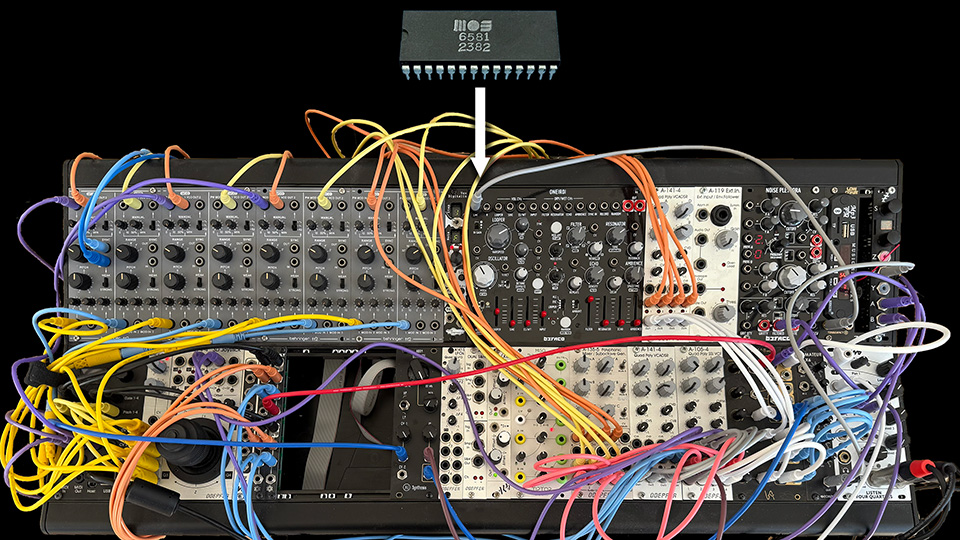

# SIDerurgy - Forge your favorite SID
## An ASID to MIDI/CV converter

This program is mainly aimed at creating a custom "SID chip" using a **modular synth** via a MIDI to CV interface.  
However, it also works with **any MIDI device** (each SID voice is sent to a different channel).  
General MIDI is supported, but this will only produce good results with simple SID tunes.  

## Is it magic ?

No.
You are in charge of remastering your favorite SID tune.  
This is just a tool, the magic is in your brain (and patch ;-)  

I use a Polyend Poly2 to convert SIDerurgy's MIDI stream to CV.  
See my setup below.  

This is still a very alpha version, but enough to have fun.   
I really have fun with this, and I hope you will too !  

## Question: Do I need a modular synthesizer like the one in the picture above (or demo videos) ?

**No. Not at all.**
That is my general purpose polyphonic modular synth, rearranged in a rush to test SIDerurgy. 
An optimized modules setup for SID tunes remastering would be very different.  
The good thing is you only need just a fractions of the modules you see in my synth.  
The bad thing is a modular synthesizer is one of the most expensive hobbies there are.  

**WARNING** - New awesome modules are continuosuly released, and they are expensive. Very expensive.  
*You have been warned.*  

## Question: I have a MIDI synthesizer. Can I use that ?

Sure you can. But this will only work for simple SID tunes.  
Several SID tunes use unique features like Ring Modulation, Hard Sync, and dynamic filtering.  
For this reason, a custom modular synth provides the highest flexibility.  

## The MIDI to CV module

SIDerurgy converts the SID internal state to MIDI, one voice per channel.  
However, a modular synth only understands CV (Control Voltage).  
So a special module (or other device) is needed to convert MIDI to CV.  

There are several MIDI to CV converters.  
I use a *Polyend Poly2* because it is very flexible. 
If you plan to remaster complex tunes, you definitely a very flexible module.  

## Polyend Poly2 recommended configuration

[TBD]

# LICENSE

Creative Commons, CC BY

https://creativecommons.org/licenses/by/4.0/deed.en

Please add a link to this github project.
